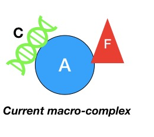
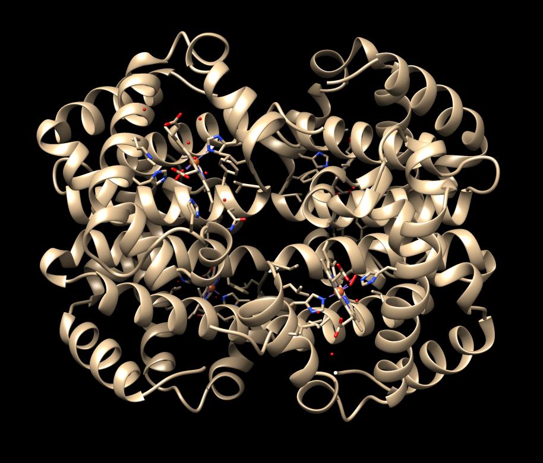
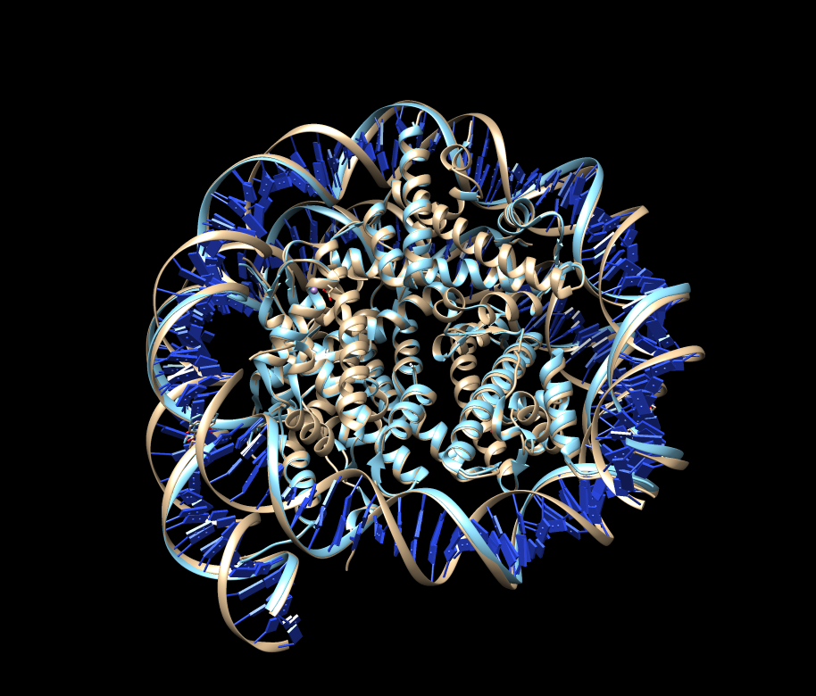
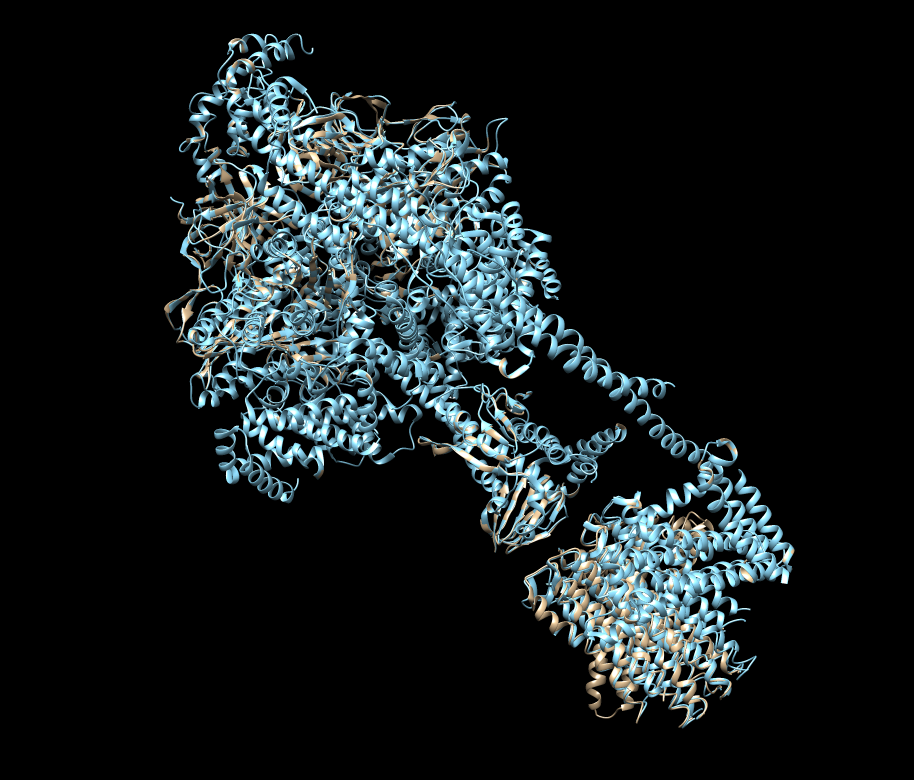
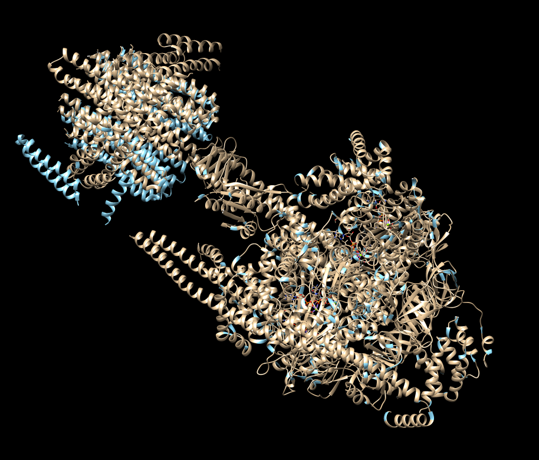
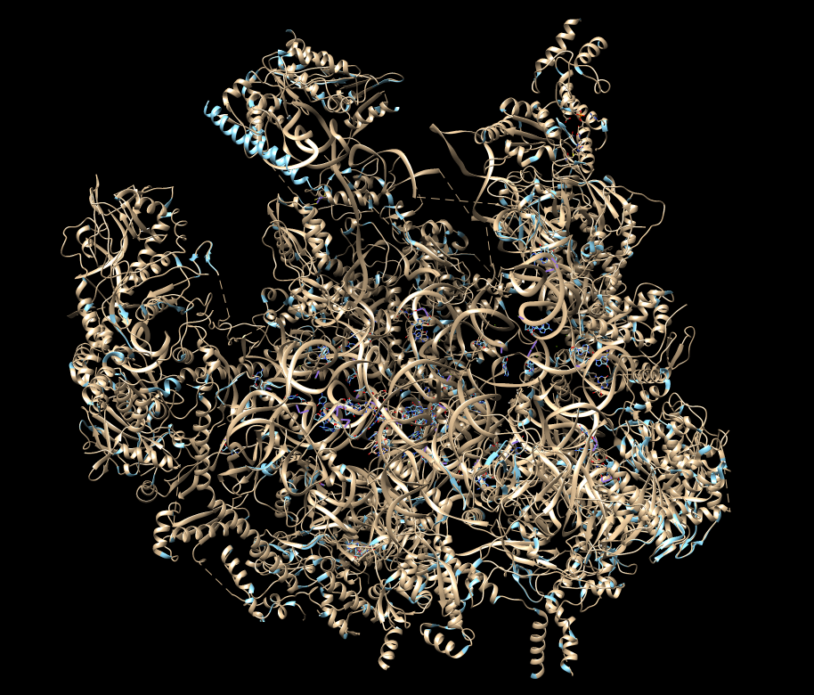
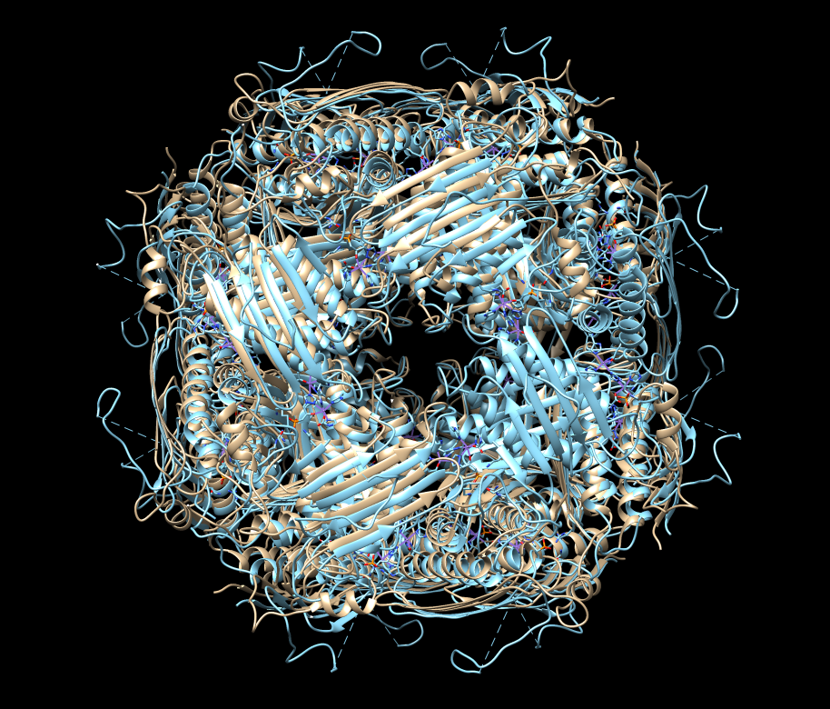
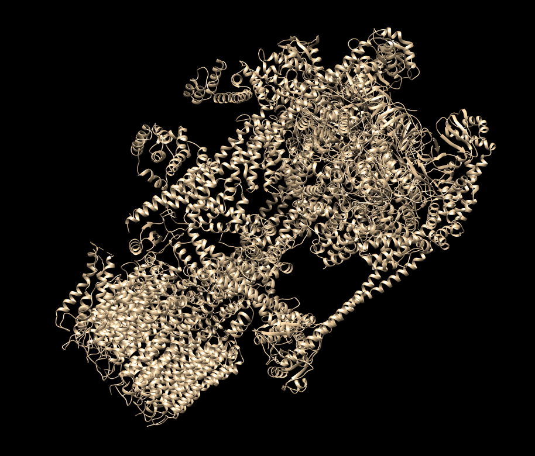

# **BioMaBuilder: Biological Macro-complex Builder**
**BioMaBuilder: A program  for reconstructing biological macro-complexes from pairwise biological interactions**.
Carolina Hernández-Oliver<sup>1</sup>, Ricard Lambea-Jané<sup>1</sup> and JV Roig-Genovés<sup>1</sup>.                    
<sup>1</sup> MSc Bioinformatics for Health Sciences, Pompeu Fabra University, Barcelona, Spain. 2020.

## **TABLE OF CONTENTS**

<!-- TOC depthFrom:1 depthTo:6 withLinks:1 updateOnSave:1 orderedList:0 -->
1. [What is BioMaBuilder?](#1.-what-is-biomabuilder)
- [Biological framework](#biological framework)
- [How does BioMaBuilder work?](#description)
	- [Arguments description and requirements](#description)
		- [Mandatory arguments](#description)
		- [Optional arguments](#description)
- [BioMaBuilder algorithms description](#description)
- [Limitations](#description)
- [Requirements](#description)
- [Installation](#description)
- [Tutorial](#description)
	- [Example 1](#description)
	- [Example 2](#description)
	- [Example 3](#description)
	- [Example 4](#description)
	- [Example 5](#description)
	- [Example 6](#description)
	- [Example 7](#description)
- [Ongoing](#description)
- [Bibliography](#description)
<!-- /TOC -->

## 1. What is BioMaBuilder?
**BioMaBuilder** (*Biological Macro-complex Builder*) is a bioinformatic tool, written in Python, to model the macro-complex structure of biomolecules, formed by proteins and DNA/RNA, from pairing interaction of a complex (protein-protein, protein-DNA/RNA) in PDB format, using the superposition strategy.  
BioMaBuilder extracts the biological information of interaction between two biomolecules given in the pairwise-biomolecule PDB files. Based on this information, the most likely macro-complex structure is built.

## 2. Biological framework
The understanding of biological processes at a molecular level is essential to get an insight into the disease mechanism, its causes, prognosis and development, and also the identification of relevant therapeutic targets. Moreover, having the structural model of a protein is one of the keys (Widerstein M and J. Sippl M, 2007) that can lead to the design of drug-like inhibitors and the development of successful treatments for diseases. Indeed, proteins act in a cell not as individual entities but in complex with other biomolecules (i.e., protein-protein (PPI), protein-DNA, and protein-RNA interactions)(Petoukhov MV, 2005 et al.; Fornes O, 2014 et al.). In that context, protein interactions are crucial in most biological processes giving rise to the functionality of a cell. For instance, a particular transcription factor may activate one gene or another depending on its interactions with other proteins not only with DNA (Garcia-Garcia J., 2012 et al.). Furthermore, the interface between two proteins is the result of the specific interaction between residue-pairs playing a structural and functional role for the interaction (Garcia-Garcia J., 2016 et al.). Therefore, the atomic determination of the interacting regions of PPI has become increasingly interesting in biological research in order to clarify not only the function but also the malfunctions of proteins (W. Senior A., 2019 et al.).

Even though protein structures can be challenging to determine experimentally, several experimental structure determination techniques have been developed and improved in accuracy, but they remain difficult and time-consuming. As a result, computational strategies have been developed to model PPI (Dill, K.A. and MacCallum, J. L., 2012), which, in combination with experimental data are useful to refine and predict its structural and dynamic aspects (Baaden M and J. Marrink S., 2013) and its extensive applicability goes from diagnosis and vaccine design to drug discovery (Barradas-Bautista D., 2018 et al). However, even if we know all individual interaction pairs of a complex, modeling the complete macro-complex is a challenge. To that end, current in-silico approaches like structure comparison methods, are being used (Kufareva I. and Abagyan R., 2012).

Here, it is presented a superimposition-based approach that works on the pairwise-interaction chains in the PDB-files format. This method takes into account the evaluation of residue correspondence obtained from such superimposition relying on distance measurements between the reference and test backbone-atomic coordinates, minimizing the global Root Mean Square Deviation (RMSD), which is a measurement of the structural similarity, and minimizing also the number of clashes produced between the neighbour-atoms in the superimposition final model. As the full potential of the genome sequencing projects will only be realized once all protein functions become known and understood (Martí-Renom MA., 2000 et. al.), an important bridging role will be played by this methodology until arising the deep comprehension of the structural and functional biology.

## 3. How does BioMaBuilder work?
BioMaBuilder uses a recursive algorithm to build the quaternary structure of a biological macro-complex. In the following section, a wide description of the recursive algorithm and how it works is given.

### 3.1. Arguments description and requirements.
BioMaBuilder can deal with several arguments, some of them are optional (the user can modify them according to its particular goal) and other ones are mandatory ( needed to run the program).
#### 3.1.1. Mandatory arguments

- ***-i / --input***

The input argument must be a directory or path directory with all the PDB files with the pairwise interactions.  
*Example:* ``` -i  /Users/peperoig/Desktop/SBI-PYT_project/1gzx_all_interactions```


**IMPORTANT**: The pairwise interaction files must have a specific format file name: xxxx_YZ.pdb, where xxxx are four characters reserved for the name of the macro-complex and, Y and Z must be the name of both chains that are interacting in the given PDB file (they can be letters, upper and lower case, or numbers).  
*Example: 1gzx_AB.pdb, 3dec_1C.pdb, 2mss_aC.pdb, 1fgg_ab.pdb, 1gzx_3z.pdb*


- ***-o / --output***

The output argument must be a directory or path directory. The program will check out if the directory exists in order to store the PDB file with the final model in it. However, if this directory does not exist, the program will create it and store the PDB file with the final model in it.  
*Example:* ``` -o  /Users/peperoig/Desktop/SBI-PYT_project/1gzx_final_model```


- ***-fa / --fasta***

The fasta argument must be a fasta file with all the sequences of the complex.  
*Example:* ``` -fa fafile.fasta, -fa fafile.fa```

#### 3.1.2. Optional arguments

- ***-v / --verbose***   

If verbose argument is applied, the progress of the program will be printed in the standard error.  
*Example:* ``` -v```


- ***-sto / --stoichiometry***

The stoichiometry argument establishes the number of chains in the final model. If not defined, the program will add the number of chains provided in the input directory.  
*Example:* ``` -sto 32```

**IMPORTANT:** It must be a natural number.


- ***-rmsd / --RMSD_threshold***

The RMSD_threshold argument sets up a root-mean-square deviation threshold. By default, the RMSD threshold is 0.6 Angstroms *(Kufareva & Abagyan, 2011).*  
*Example:* ``` -rmsd 0.9```


- ***-cs / --core_selection***

The core_selection argument allows establishing the reference file that will act as a core for the macro-complex building. This argument can reduce the computational cost of the program. In the algorithm description section, a further explanation about this argument is given.  
*Example:* ``` -cs 1gzx_AC.pdb```

**IMPORTANT:** It must be an existing file in the input directory.


- ***-ncl / --number_clashes***  

The number_clashes argument sets up the maximum number of clashes allowed during the superimposition. By default is defined as 30 clashes. Regarding this number, the superposition step will be more or less strict.
*Example:* ``` -ncl 23```


- ***-of / --output_filename***

The output_filename argument sets up the name of the final PDB file. By default, the name of the file will be macrocomplex.

**IMPORTANT:** It must be defined without any extension(i.e. .pdb).   
*Example:* ``` -of 1ghs_model_BioMaBuilder```


## 4. *BioMaBuilder* algorithm’s description
BioMaBuilder uses a recursive algorithm which will be explained in this section step by step.
As have been explained in ***argument description and requirements*** section, as input, a directory containing all the PDB files with the pairwise interactions is given.
BioMaBuilder uses an internal function to obtain all the PDB files present in the input directory. In this step, the program is able to handle errors such as the name given by the user as an input, actually is not a directory.

Once the PDB files have been obtained, the algorithm calls another internal function, ***get_best_core***. This function search through all PDB files given as input and looks to select the molecule more times repeated. That means that a molecule in which more interactions with different molecules presents is selected as a core for the macro-complex building. This selection will reduce the computational cost of the program due to the nature of the recursive macro-complex build used in this tool. However, the user can also select the core of the macro-complex for particular goals.

When the core file has been selected, and the structure object is obtained using the internal function, ***obtain_structure***(that is based on the PDBParser module of Biopython) the program calls the recursive function to start constructing the macro-complex.

This recursive function, called ***BioBuilder***, takes as arguments, the structure object of the core, a list containing all the PDB files provided in the input argument (*pdb_files*), three different arguments for internal use: - 1. *num_iterations*: To keep track of the number of iterations the function does. - 2. *stop_counter*: To keep track of the number of files that do not add any chain to the core complex (this value will be one of the two conditions to stop the recursive function). - 3. *id_counter*: Useful argument to deal with errors in chain nomenclature. And finally, the different arguments the user can work with, such as *stoichiometry*, *RMSD_threshold*, *number_clashes*, *input_directory* and, *verbose*.

***BuiBuilder*** function starts measuring the number of chains present in the core_structure ( that will be the final macro-complex), at this step, the chains present should be 2 (since they are those presents in the PDB file assigned as the core). Then, the function checks out if the conditions to finish the macro-complex have been fulfilled. These conditions are 1. The stoichiometry provided by the user is equal to the number of chains present in the macro-complex. 2. If there is not any PDB file that can keep adding new chains to the macro-complex.

Once the stop conditions have been checked out, and the macro-complex build can go on, the function select the first PDB file in the *pdb_files* and define it as test file (that will be tested in order to know if it presents some potential chain to add to the macro-complex). The structure object of the test file is obtained using ***obtain_structure*** function.
Now, it starts the main part of the function, which consist on superposing the chains present in both the core file and the test file, and therefore, performing 4 different superpositions of alpha carbons (*CA*) in each iteration of the recursive function (i.e. If the core file has the chains *A* and *C*, and the test file has the chains *A* and *F*, the superpositions will be *A-A*, *A-F*, *C-A*, *C-F*). These superpositions are performed using the internal function superimpose_structures which takes as arguments the structure objects of core and test files, and the *RMDS_threshold* argument given by the user (or the default value for this argument).

The superimpose_structures function obtain the molecule type of each chain (since they can be protein, DNA or RNA) and the correspondent backbone atoms ( *CA* in the case of proteins or 4’ carbons (*C4’*) in the case of RNA/DNA) using the internal functions ***get_molecule_type*** and ***get_backbone_atoms_protein*** / ***get_backbone_atoms_nucleicacids*** respectively.


In this way, the superposition of both chains only will take place if they are the same type of molecule (protein-protein, DNA-DNA or RNA-RNA) and if both chains have the same number of backbone atoms (making sure that they are the exactly the same molecule, in terms of molecule type and number of atoms).
Following with the previous example, imagine that the chain *A* in core file and test file is a protein molecule with 800 atoms, the core file chain *C* is a DNA molecule with 300 atoms, and the test file chain *F* is a protein molecule with 400 atoms. Only the superposition of chain *A* (core file) with chain *A* (test file) will be performed since they share the same molecule type and the number of atoms.

At this point, when a superposition is done, the correspondent RMSD value is compared with *RMSD_threshold* argument value, and only those superpositions that present a smaller RMSD value than the threshold will be consider as valid superpositions.
All the valid superpositions will be stored in a dictionary with the molecule combination as keys *(A-A)* and the RMSD-value of the superposition as value. Then, this dictionary will be sorted according to the RMSD values (from smaller to bigger ones). Finally, the ***superimpose_structures*** function will return to ***BioBuilder*** function the sorted dictionary with all the valid superpositions, the value of the best RMSD obtained, and a Boolean variable which will be true if a valid superposition has been taken place.

***BioBuilder*** function is going to work with these results from ***superimpose_structures*** function.

First, the Boolean variable result is checked, if the result is *False* which means that there is not valid superimposition, the list containing all the PDB files is modified and the first file (selected in this iteration as test file) is sent to the last position in the list. And for *num_iteration* and *stop_counter* variables, one unit is added, since the current test file is not able to add any chain to the macro-complex.  Thus, the ***BioBuilder*** is called itself, selecting a new file as a test file.

However, if the Boolean variable result is *True*, therefore, there is at least one valid superposition. Following the previous example, the unique valid superposition would be *A-A*, but actually, the interesting part of the superposition is the following:


The matrices of rotation and translation, applied in the superposition, now apply to the atoms of the chain of test file which is not in the core test (chain *F* in the example). Therefore, this chain is now considered as a potential chain to add to the macro-complex.

Before adding the potential chain to the macro-complex the ***BioBuilder*** function checks if this chain is already present in the macro-complex. Using the NeighbourSearch class in order to find all the atoms of the potential chain to add within the radius of whatever macro-complex chain.

The method *search* of this class iterate through all the atoms of the potential chain looking for clashes with atoms in the macro-complex. The clashes are stored in a list, and then the length of it is compared to the *number_clashes* argument value. If the length of the list is greater than the *number_clashes* value that means the chain is already present in the macro-complex, and therefore, the chain is discarded. And  the ***BioBuilder*** function is called itself again, adding one more unit to *stop_counter* variable.  
Otherwise, if the length of the clashes list is lower than the *number_clashes* value, the chain is added to the macro-complex. And the ***BioBuilder*** function is called itself again, changing the test file and rewriting the *stop_counter* as zero.





Notice, that the ***get_best_core*** function reduces the computational cost since, all the files which can add some chain to the macro-complex model will be selected probably first.

Once ***BioBuilder*** has iterate through all the PDB files, two scenarios can take place: 1. The macro-complex have achieved the number of chains defined on the *stoichiometry* argument. 2. Any file is able to add a new chain to the macro-complex since all chains are already added. In both scenarios, the ***BioBuilder*** function finishes returning a structure object containing the macro-complex and it will be stored in a *.pdb* or *.cif* file according to the macro-complex size.
Finally, as an extra, **BioMaBuilder** also generates a *.txt* file with the pairwise alignments among the sequences provide in the fasta file.


## 5. Limitations
- **BioMaBuilder** is able to work with macro-complex up to 99.999 atoms (since it is under the   PDB format limitations) or up to 62 chains.
- The **BioMaBuilder** computational cost increases linearly.

## 6. Requirements
**BioMaBuilder** requires the following python modules and packages:

- Python v.3.6 or higher.
- Biopython v.1.76 or higher.
- argparse module
- sys module
- os module
- re module
- pairwise2 module

For further visualization of macro-complex you can use Chimera, ICM, or PyMol.

## 7. Installation

To install the **BioMaBuilder** package the user just needs to download the **biomabuilder-0.1.0.tar.gz** (which can be found inside the `dist` folder), which is a source archive, and unpack it. Doing that, a directory named biomabuilder-0.1.0 will be created, then `cd` into that directory, where `setup.py` should be (check it before continuing), and run: ``` python3 setup.py install```, which will ultimately copy all files from the package to the appropiate directory for third-party packages in the users Python installation.

## 8. Tutorial

First of all it is important to state that we did not install the package, so we are running it from within the biomabuilder folder, where all the scripts are stored. Take into account that the input, fasta, and output arguments can be a path where those files are stored, so the examples provided here probably will not work in your computer, each user has to adapt the command line syntaxis for his particular case.
For the visualization of the macrocomplexes we used the Chimera software, in light brown can be seen the structures created by our algorithm, and in light blue the original structures from PDB database.


### **EXAMPLE 1:**
The first example is the protein **1gzx**, which is the oxy T state haemoglobin from *Homo sapiens*. This protein hetero 4-mer (A2B2).
To run our program we execute the following command:

```bash
  python3 biobuilder_core.py -i /1gzx -fa fastafile.fa -o out_dir -of 1gzx -sto 4 -v
```

Note that we are executing our program with `python3` at the beginning, and that is because the program has not been installed, but if it has been installed, `python3` would not be necessary. That works for all the examples.

About the arguments used after the script name, there are the mandatory input `-i` and output `-o` directories, the fasta file argument `-fa`, we also called the optional output filename `-of` argument, the stoichiometry `-sto` argument with a value of 4 as it is the number of chains present in the complex, and finally the verbose argument `-v` to redirect to the standard error channel the verbose statements.

Using `time` at the beginning of the command (`time python3 biobuilder...`) when running the shell allows us to see the total amount of time the process lasted. In this example it took 0.810 seconds. 
The RMSD after running MatchMaker is 0.000 angstroms.

Matchmaker 1gzx_original.pdb, chain B (#1) with 1gzx.pdb, chain B (#0), sequence alignment score = 788.5
with these parameters:
	chain pairing: bb
	Needleman-Wunsch using BLOSUM-62
	ss fraction: 0.3
	gap open (HH/SS/other) 18/18/6, extend 1
	ss matrix:  (O, S): -6 (H, O): -6 (H, H): 6 (S, S): 6 (H, S): -9 (O, O): 4
	iteration cutoff: 2
RMSD between 146 pruned atom pairs is 0.000 angstroms; (across all 146 pairs: 0.000)




### **EXAMPLE 2:**
The second example is the protein **3kuy**, which corresponds to DNA stretching in the nucleosome, which in turn facilitates alkylation by an intercalating antitumor agent, and it comes from *Escherichia coli*. This protein is a hetero 8-mer (A2B2C2D2).
To build our model we execute the following command:

```bash
  python3 biobuilder_core.py -i /3kuy -fa fastafile.fa -o out_dir -of 3kuy -sto 10 -v
```

In that case we use 10 as the stoichiometry value as there are 8 protein chains and 2 acid nucleic molecules. The computational time this example took was 2.989 seconds. As can be seen, the superimposition is not perfect, but it is quite good.
The RMSD after running MatchMaker is 0.000 angstroms.

Matchmaker 3kuy_original.pdb, chain C (#1) with 3kuy.pdb, chain C (#0), sequence alignment score = 533
with these parameters:
	chain pairing: bb
	Needleman-Wunsch using BLOSUM-62
	ss fraction: 0.3
	gap open (HH/SS/other) 18/18/6, extend 1
	ss matrix:  (O, S): -6 (H, O): -6 (H, H): 6 (S, S): 6 (H, S): -9 (O, O): 4
	iteration cutoff: 2
RMSD between 106 pruned atom pairs is 0.000 angstroms; (across all 106 pairs: 0.000)




### **EXAMPLE 3:**
The third example is the protein **5ara**, which is a bovine mitochondrial ATP synthase from *E. coli* BL21(DE3). This protein is a hetero 22-mer (A8B3C3DEFGHIJK).
In order to buil the complex we run on the shell the command:
```bash
  python3 biobuilder_core.py -i /5ara -fa fastafile.fa -o out_dir -of 5ara -sto 22 -v
```
The computational time in this case was 13.222 seconds.The RMSD after running MatchMaker is 0.000 angstroms.

Matchmaker 5ara_original.pdb, chain A (#1) with 5ara.pdb, chain A (#0), sequence alignment score = 2557.5
with these parameters:
	chain pairing: bb
	Needleman-Wunsch using BLOSUM-62
	ss fraction: 0.3
	gap open (HH/SS/other) 18/18/6, extend 1
	ss matrix:  (O, S): -6 (H, O): -6 (H, H): 6 (S, S): 6 (H, S): -9 (O, O): 4
	iteration cutoff: 2
RMSD between 509 pruned atom pairs is 0.000 angstroms; (across all 509 pairs: 0.000)




### **EXAMPLE 4:**
The fourth example is the protein **5dn6**, an ATP synthase from *Paracoccus dentrifricans* (strain Pd 1222). It is a hetero 27-mer (A12B3C3DEFGHIJKL).
To build the model we execute the following command in the shell:

```bash
  python3 biobuilder_core.py -i /5dn6 -fa fastafile.fa -o out_dir -of 5dn6 -sto 27 -v
```
The computational time was 14.164 seconds.




### **EXAMPLE 5:**
The fifth example is the protein **5oom**, a structure of a native assembly intermediate of the human mitochondrial ribosome with unfolded interfacial rRNA. It is a hetero 53-mer  (ABCDEFGHIJKLMNOPQRSTUVWXYZabcdefghijklmnopqrstuvwxyzA).
To build the model we execute the following command:

```bash
  python3 biobuilder_core.py -i /5oom -fa fastafile.fa -o out_dir -of 5oom -sto 53 -v
```

The computational time has been 1 minute and 7.917 seconds.




### **EXAMPLE 6:**
The sixth example is the protein **6ezm**, which is a imidazoleglycerol-phosphate dehydratase from *Saccharomyces cerevisiae*. It is a homo 24-mer (A24).
We run the next command on the shell to build it:

```bash
  python3 biobuilder_core.py -i /6ezm -fa fastafile.fa -o out_dir -of 6ezm -sto 24 -v
```

The computational time has been 6.389 seconds.




### **EXAMPLE 7:**
The seventh example is the protein **5vox**, which is a V-ATPase from *S. cerevisiae* (strain ATCC 204508/S288c). It is a hetero 33-mer (A8B3C3D3E3F3GHIJKLMNOP).
To build the model we execute the following command:

```bash
  python3 biobuilder_core.py -i /5vox -fa fastafile.fa -o out_dir -of 5vox -sto 33 -v
```

The computational time was 22.505 seconds. The RMSD after running MatchMaker is 0.000 angstroms.

Matchmaker 5vox_original.pdb, chain b (#1) with 5vox.pdb, chain b (#0), sequence alignment score = 3058.7
with these parameters:
	chain pairing: bb
	Needleman-Wunsch using BLOSUM-62
	ss fraction: 0.3
	gap open (HH/SS/other) 18/18/6, extend 1
	ss matrix:  (O, S): -6 (H, O): -6 (H, H): 6 (S, S): 6 (H, S): -9 (O, O): 4
	iteration cutoff: 2
RMSD between 634 pruned atom pairs is 0.000 angstroms; (across all 634 pairs: 0.000)




## 9. Ongoing

Future approaches that would be added to this program include:
- Handling small compounds such hormones, peptides, metabolites or drugs.
- Performing a refinement of the final macro-complex allowing the model dynamics and flexibility.
- Being able to test complexes composed of more than 99.999 atoms or a number of chains greater than 62.
- Generating more than one possible model.

## 10. Bibliography
- Kufareva, I., & Abagyan, R. (2011). Methods of Protein Structure Comparison. Methods In Molecular Biology, 231-257. doi: 10.1007/978-1-61779-588-6_10.
- Garcia-Garcia, J., Bonet, J., Guney, E., Fornes, O., Planas, J. & Oliva, B. (2012). Networks Of Protein-protein Interactions: From Uncertainty To Molecular Details. Molecular Bioinformatics. doi: 10.1002/minf.201200005.
- Fornes, O., Garcia-Garcia, J., Bonet, J. & Oliva, B. (2014). On The Use Of Knowledge-Based Potentials For The Evaluation Of Models Of Protein–Protein, Protein–DNA, And Protein–RNA Interactions. Advances in Protein Chemistry and Structural Biology. Vol. 94, Chapter 4. doi: 10.1016/B978-0-12-800168-4.00004-4.
- Garcia-Garcia J., Valls-Comamala V., Guney E., Andreu D., Muñoz FJ. & Fernandez-Fuentes N. (2016). iFraG: a protein–protein interface prediction. Journal Of Molecular Biology. doi: 10.1016/j.jmb.2016.11.034.
- Wiederstein, M. & Sippl, M. (2007). Prosa-Web: Interactive Web Service For The Recognition Of Errors In Three-Dimensional Structures Of Proteins. Nucleic Acids Research, Vol. 35, Web Server issue. doi: 10.1093/nar/gkm290.
- Petoukhov, M. & Svergun, D. (2005). Global Rigid Body Modeling Of Macromolecular Complexes Against Small-Angle Scattering Data. Biophysical Journal. Volume 89, 1237–1250. doi: 10.1529/biophysj.105.064154.
- Senior, A., Evans, R., Jumper, J., Kirkpatrick, J., Sifre, L., Green, T., Qin, C., Žídek, A., Nelson, A., Bridgland, A., Penedones, H., Petersen, S., Simonyan, K., Crossan, S., Kohli, P., Jones, D., Silver, D., Kavukcuoglu, K. & Hassabis, D. (2019). Improved Protein Structure Prediction Using Potentials From Deep Learning. Nature. doi: 10.1038/s41586-019-1923-7.
- Baaden, M. & Marrink, S. (2013). Coarse-Grain Modelling Of Protein–Protein Interactions. Current Opinion in Structural Biology 2013, 23:878–886. doi: 10.1016/j.sbi.2013.09.004.
- Barradas-Bautista D., Rosell M., Pallara C. & Fernandez-Recio J. (2017). Structural Prediction Of Protein-Protein Interactions By Docking: Application To Biomedical Problems. Elsevier. doi: 10.1016/bs.apcsb.2017.06.003.
- Martí-Renom, M., Stuart, A., Fiser, A., Sánchez, R., Melo, F. & Sali, A. (2000). Comparative Protein Structure Modeling Of Genes And Genomes. Biophys. Biomol. Struct. 2000. 29:291–325. doi: 10.1146/annurev.biophys.29.1.291.
- Alexiou, A. & Ashraf, G. (2017). Protein-protein interaction (PPI) network: Recent advances in drug discovery. Current Drug Metabolism. 18. 5-10. doi: 10.2174/1389200217666161102150602.
